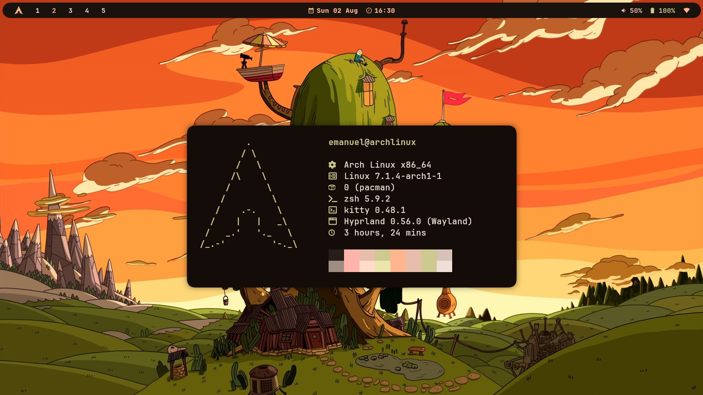

# May Hyprland Dotfiles



---

## 💻 Stack & Tools

- **OS:** Arch Linux
- **Terminal:** Kitty
- **Editor:** Neovim (LazyVim)
- **Application Launcher:** rofi-wayland

---

## Installation

- **Dependencies:**

```bash
sudo pacman -S hyprland hyorlock waybar mako kitty rofi-wayland cava fastfetch awww matugen starship
```

- **Copy and paste the configuration files:**

```bash
cd dotfiles
cp -r .config/* $HOME/.config/
cp .zshrc $HOME/.config/
```
